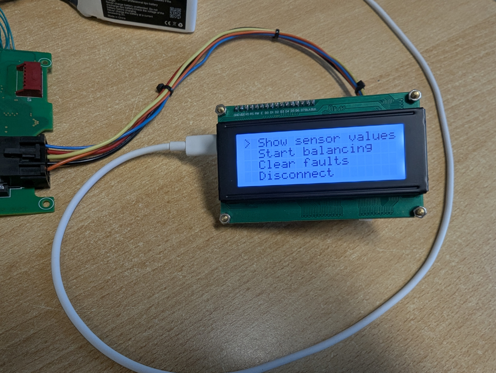
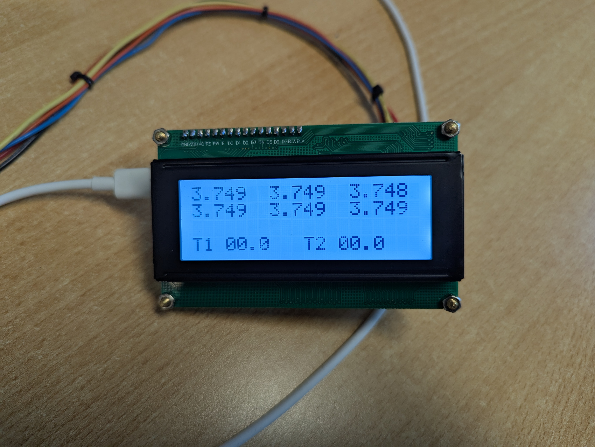

# TeslaBMBCheck
Simple device that reads the voltage levels and temperatures from a Tesla Model S BMB board. It also supports balancing and clearing faults.

## Module Locations

## BMB Components

For each brick the BMB has a group of identical SMD components to read the voltage levels and do balancing. The elements in the topmost rectangle have already been replaced and re-sealed with epoxy.

## BMB Single Group For A Brick

The components here often have corrosion damage.

## BMB Resistor And Capacitor Values

These are the values I measured.

